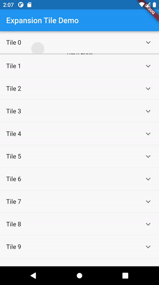

# Expansion Tile Open/Close Demo

This demo shows you how to open an expansion tile while simultaneously closing an already open tile using the Expansion Tile widget.



## Getting Started

```text
Flutter 3.0.6-0.0.pre.1 • channel stable • https://github.com/flutter/flutter.git
Framework • revision 7ce44f121f (13 days ago) • 2022-08-19 14:37:55 -0500
Engine • revision e85ea0e79c
Tools • Dart 2.17.6 • DevTools 2.12.2
```

Clone the repository to your dev pc. Inside the lib directory you will see two files:

1. main.dart
2. expansion_tile_copy.dart

---

### _expansion_tile_copy.dart_ File

- This file contains a copy of the Flutter source code for the expansion tile. The only difference is that we changed the class name to "ExpansionTileCopy" and added two methods to the state class:

```dart
// Added to class
void closeExpansion() {
if (_isExpanded) _handleTap();
}

// Added to class
void openExpansion() {
if (!_isExpanded) _handleTap();
}
```

- These methods will allow us to open/close the specified expansion tile.

---

### _main.dart_ File

```dart
final _tileKeys = [];
var _selectedIndex = 0;
```

- The code above is added top level to allow for global access outside of the class. Can be contained within the class if for isolated use.
  - The **\__tileKeys_** list stores the **_GlobalKeys_** assigned to each expansion tile.
  - The **\__selectedIndex_** variable stores the index of the currently opened expansion tile.

```dart
ListView.separated(
    itemBuilder: (context, index) {
        final tileKey = GlobalKey();
        _tileKeys.add(tileKey); // <- Add tile key to [_tileKeys] list.
        return ExpansionTileCopy(
            key: tileKey, // <- Add a key to each tile.
            title: Text("Tile $index"),
            children: [
                Container(
                    color: Colors.grey[350],
                    height: 200,
                    child: Center(
                    child: Text("Tile $index Body"),
                    ))
            ],
            onExpansionChanged: (value) {
                // If tile is expanding, then collapse the already expanded tile.
                if (value) {
                    if (index != _selectedIndex) {
                        _tileKeys[_selectedIndex].currentState!.closeExpansion();
                    }
                    _selectedIndex = index;
                }
            },
        );
    },
    separatorBuilder: (context, index) => const Divider(height: 0),
    itemCount: 100));
```

- Each generated GlobalKey is stored in the **\__tileKeys_** list.
- The generated GlobalKey is assigned to the ExpansionTileCopy **_key_** field.
- In the **_onExpansionChanged_** callback function, we check if the value is true, which indicates the tile is opening. We only want to execute the block if we are expanding another tile. If the index of the tile being expanded does not equal the **\__selectedIndex_** value, then we want to fetch the GlobalKey for the currently expanded tile by it's index, which is represented by the **\__selectedIndex_** value. Once the **_GlobalKey_** is obtained, we then execute the **_closeExpansion_** method that we added to the ExpansionTileCopy state class.
- We then assign the new index to the **\__selectedIndex_** variable.

### And that's it. I hope this help's you in your future projects. Please leave me any questions, comments, or concerns and I will be happy to respond. Thank you
